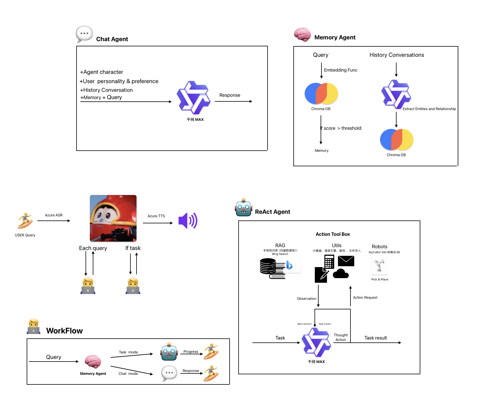
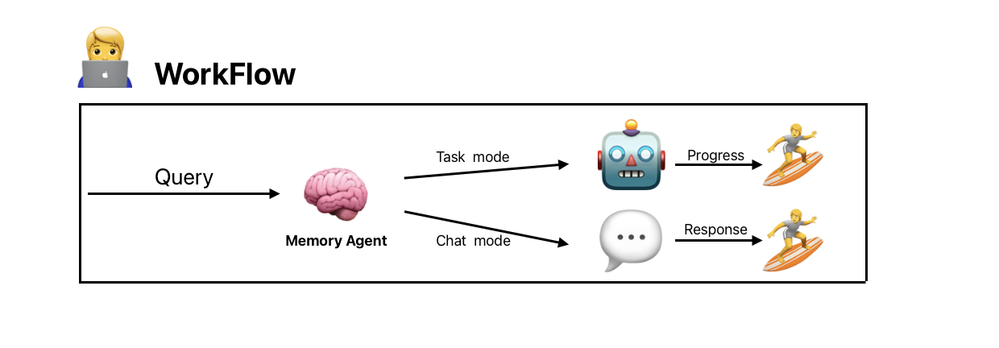

<p align="center">
  
</p>


# Kabutack

A **mini Auto-GPT** like multimodality AI assistant. It is designed for engaging in personalized communication with user and performing some simple tasks. It will the core component of my Robotics system include a desktop robot, robotics dog, home AGV and robotics arm.

The current entire system is composed of three agents: 
* 💬**chat agent**, which is responsible for receiving users' regular chat requests and sending some greetings to users during set time periods. 

* 🤖**task agent**, which employs a **ReAct** paradigm to perform user's task request by calling a predefined tools step by syep. 

* 🧠**memory agent**, which performs memory retrieval and conversations persistence, it is the implementation of the agent's long-term memory. Memory agent is optional.

<br>
<br>

 

<br>
<br>

# Version
V1.5 feature
1. Auto-GPT minimum system
2. long-term memory
3. ReAct based task solver


<br>
<br>

# WorkFlow
  

1. Server accepts user's query, if memory agent is employed, then the query will be sent to the memory agent to retrieval the related memory related to the current query such as user's preference.
2. According to the user's intent(/chat_mode or /task_mode), the query and memory(if there is one) will be routed to the corresponding agent.
3. chat agent's chat function will give response to user directly
4. task agent accepts user's task and return, the tasks progress will be stored in a task progress queue, user client will get task progress from the queue util the task is finished.

<br>
<br>

# QuickStart🚀
## Configuration
(At this moment the configuration procedure is quite tedious😢, lots of accounts may be needed, apologies for the inconvenience🙏)

You will need to configure your system in the **config.yaml**. Please read the config.yaml for all the configurations you need. The neccessary components are following, and some instructions are attached.

#### LLM
The system supports **Ollama, openai(sdk) and dashscope** platform because most LLM service can be accessed through these platform. For Ollama, you will need to install ollama client and pull the model in your computer. For OpenAI SDK and dashscope you have to get the corresponding api-key and endpoint from your console. Check if you llm supports one of these platform, if not you could implement in core/llm. Here are some llm and their corresponding platform:  

**ollama**: llama2/3, llava(multimodal), phi, mistral series, uncensored models... <br>
**openai**: Kimi, Yi-large, deepseek, qwen... <br>
**dashscope**: llama, chatglm, qwen, qwenVL(multimodal)

My configuration  
chat_llm: Kimi(https://platform.moonshot.cn/docs/intro#%E4%B8%BB%E8%A6%81%E6%A6%82%E5%BF%B5), openai platform  
task_llm: qwen-max(https://dashscope.aliyun.com/), openai or dashscope platform  
multimodal_llm: qwen-vl-max(https://dashscope.aliyun.com/) dashscope platform

<br>

#### Memory agent
The memory agent employs Ali's **dashvector** vector database service for memory retrival and persistence. You will need to create a account for this.  
🚧 Local ChromaDB will be employed as vectorDB in the futher. 🚧  

Register dashvector(https://www.aliyun.com/product/ai/dashvector)


<br>

#### Tools
You may choose the tools you want to use by setting the “**use**“ field as "positive", otherwise set "negative". <br>
By default, the system has some simple tools for testing, include: calculator, compare, search_engine and email. <br>
search_engine and email will need a custom configuration, search_engine in this system employs Azure Bing search, so you may register a Azure account, and create a bing search service. email uses NetEase 126 email service, you have to create an account for the agent.

Register Azure(https://azure.microsoft.com/zh-cn/)

<br>
<br>

## Install
Test on MacOS
```bash
conda create --name kabutack python=3.10
conda activate kabutack
pip install -r requirements.txt -i https://pypi.tuna.tsinghu.edu.cn
```
* grpcio will take few(about 6) minutes to install


<br>
<br>

## Run
In a terminal
```bash
python ./scripts/start_app.py
```

In another terminal
```bash
python ./scripts/start_client.py
```
Then you may type the query in the terminal,  type "/chat_mode" or "/task_mode" to switch mode.

<br>
<br>

# Developing

🚧 Improved ASR & TTS, azure asr and tts are provided in utils/audio.py, you could use it by providing the api-keys  
🚧 Token managements  
🚧 Skills learning   
🚧 Robotics agents  
🚧 UI
🚧 Improve task agent
🚧 (opetional)Distributed agents server

<br>
<br>


# Appendix
* https://github.com/Significant-Gravitas/AutoGPT
* https://arxiv.org/abs/2210.03629
* https://github.com/cpacker/MemGPT